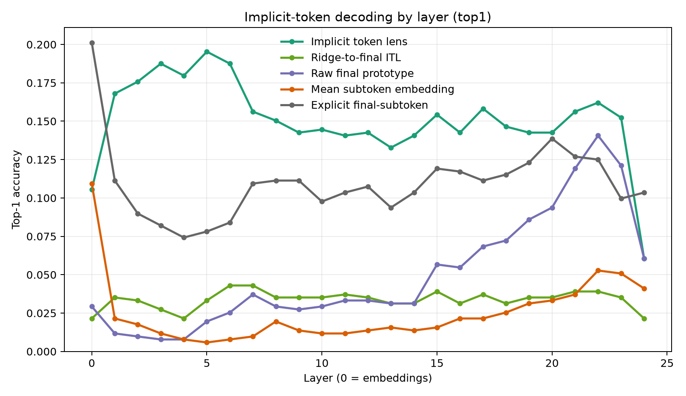
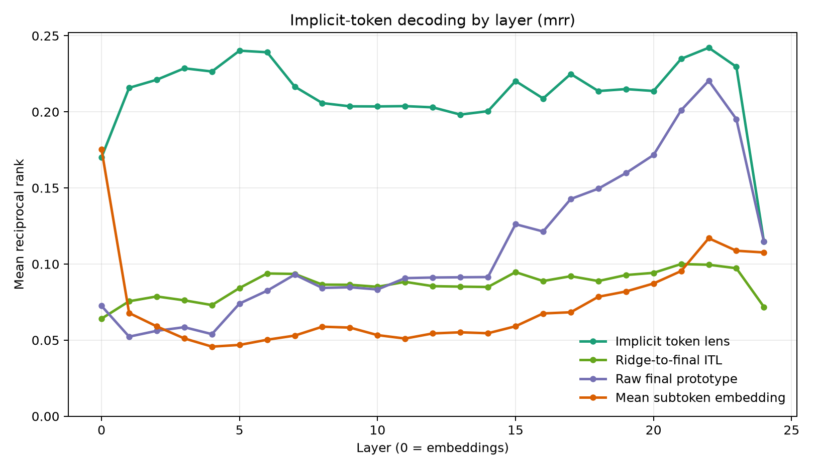

# Logit Lens with Implicit Tokens

## 1. Executive Summary

This project tested whether a logit-lens-style decoder can output implicit vocabulary items, not just explicit tokenizer IDs. I operationalized "implicit tokens" as whole English word types that Qwen2.5-0.5B tokenizes into multiple pieces, then built an implicit vocabulary table from hidden-state prototypes for those words.

The main result is positive but bounded: a layer-local implicit-token lens decoded held-out occurrences among 128 multi-token word entries at 19.5% top-1 accuracy, versus 12.5% for the final-subtoken majority baseline and 0.78% chance. The selected ITL also beat the strongest raw-final-prototype implicit baseline on test by 5.5 percentage points, with a paired bootstrap 95% CI of [2.1, 8.8] points.

The practical implication is that an implicit-token logit lens is feasible in a supervised/prototype setting. The stronger Tuned-Lens-style ridge translator to final-layer prototypes did not work well at this data scale, so the best current method is a layer-local implicit vocabulary table rather than one universal translated output space.

## 2. Research Question & Hypothesis

**Research question:** Can we construct a lens that maps intermediate LLM hidden states to implicit vocabulary items, where each item is a multi-token whole word absent from the explicit tokenizer vocabulary?

**Hypothesis:** LLM hidden states contain reusable whole-word representations for multi-token words, and a vocabulary-like table of those representations can decode held-out occurrences better than explicit-token or compositional baselines.

This matters because standard logit lenses are constrained by the tokenizer vocabulary. The motivating paper, "Token Erasure as a Footprint of Implicit Vocabulary Items in LLMs," argues that models rapidly erase component-token information for multi-token words/entities and use higher-level latent items instead. This experiment asks whether those latent items can be exposed as a lens output space.

## 3. Literature Review Summary

The gathered literature supports four relevant points:

- Token erasure and inner-lexicon work suggest that multi-token words are reconstructed into whole-word internal representations.
- Tuned Lens shows that affine translators can make intermediate states decodable, but still decodes into explicit tokenizer vocabulary.
- Patchscopes can verbalize hidden states more flexibly, but does not provide a reusable vocabulary-like output table.
- Prompt/prefix tuning shows that continuous vectors can function like tokens outside the tokenizer matrix, motivating a broader notion of token-like representations.

This experiment fills a small gap: it creates a quantitative implicit vocabulary table and evaluates whole-word retrieval directly, rather than only projecting to explicit token IDs or asking a model to verbalize an activation.

## 4. Methodology

### Model and Data

- Model: `Qwen/Qwen2.5-0.5B`, a real HuggingFace causal LM with accessible hidden states.
- Dataset: local WikiText-2 raw from `datasets/wikitext2_raw/`.
- Candidate implicit vocabulary: 128 lowercased alphabetic word types that tokenize into at least two pieces under Qwen's tokenizer.
- Leakage control: candidates were arranged as 16 final-subtoken groups with 8 words per group, so knowing only the final tokenizer ID gives 1/8 = 12.5% word accuracy.
- Splits: 10 train, 2 validation, and 4 test occurrences per word, for 2,048 total examples.
- Hidden states: final-position hidden states for the last subtoken of the target word, all 25 hidden-state levels including embeddings, hidden size 896.

Example candidate group:

| Final token | Candidate words |
|---|---|
| `land` | england, ireland, maryland, queensland, portland, lowland, finland, highland |
| `on` | xenon, galveston, simon, eaton, algernon, baron, luzon, lebanon |

### Lens Methods

**Implicit Token Lens (ITL, primary):** for each layer and each word type, average normalized training hidden states into a layer-local prototype row. At test time, score a held-out hidden state by cosine similarity to all 128 word prototypes at that layer.

**Raw final-prototype baseline:** build word prototypes only from final-layer train states and compare every layer directly to that fixed final-layer table.

**Mean-subtoken embedding baseline:** average the input embeddings of each candidate word's tokenizer pieces and score hidden states against these compositional word vectors.

**Final-subtoken majority baseline:** use only the final tokenizer piece ID and predict the most frequent training word in that suffix group.

**Ridge-to-final implicit lens ablation:** train a per-layer ridge translator to map a hidden state into the final-layer prototype space, then score against final prototypes. This was included because it is closest to Tuned Lens' affine-translator idea.

### Compute and Reproducibility

The environment was isolated in `.venv` and managed by `pyproject.toml`. The full run used `CUDA_VISIBLE_DEVICES=1` on one NVIDIA RTX A6000. Initial GPU detection found four RTX A6000 GPUs; the experiment process saw one selected A6000 with about 50.6 GB free. Batch size was 64.

Key package versions are saved in `results/package_versions.json`:

| Package | Version |
|---|---:|
| Python | 3.12.8 |
| PyTorch | 2.12.1+cu130 |
| Transformers | 5.12.1 |
| Datasets | 5.0.0 |
| NumPy | 2.5.0 |
| SciPy | 1.18.0 |
| scikit-learn | 1.9.0 |

Reproduction command:

```bash
source .venv/bin/activate
HF_HOME=./artifacts/hf_cache CUDA_VISIBLE_DEVICES=1 python src/run_implicit_token_lens.py --batch-size 64
```

A second cached rerun produced identical SHA-256 hashes for `results/summary.json`, `results/metrics_layerwise.csv`, and `results/additional_comparisons.json`.

## 5. Results

### Main Table

Validation-selected layers were used for the fair test comparison.

| Method | Selected layer | Validation top-1 | Test top-1 | Test top-5 | Test MRR |
|---|---:|---:|---:|---:|---:|
| Implicit Token Lens | 5 | 21.09% | 19.53% | 25.59% | 0.240 |
| Final-subtoken majority | n/a | 12.50% | 12.50% | n/a | n/a |
| Raw final prototype | 22 | 11.33% | 14.06% | 29.69% | 0.220 |
| Mean subtoken embedding | 0 | 8.59% | 10.94% | 21.88% | 0.175 |
| Ridge-to-final ITL ablation | 17 | 6.25% | 3.71% | 11.52% | 0.092 |
| Majority word | n/a | 0.78% | 0.78% | n/a | n/a |

The ordinary explicit final-subtoken embedding diagnostic reached 20.12% top-1 on test at layer 0, but this predicts only one of 16 final-token IDs, not one of 128 whole-word labels. It should be interpreted as token-identity recoverability, not whole-word decoding.

### Statistical Tests

Primary comparison, ITL layer 5 versus final-subtoken majority:

- Accuracy difference: +7.03 percentage points.
- Bootstrap 95% CI: [2.53, 11.72] points.
- Paired randomization p = 0.0045.
- McNemar exact p = 0.0046.

Additional comparison, ITL layer 5 versus raw final-prototype layer 22:

- Accuracy difference: +5.47 percentage points.
- Bootstrap 95% CI: [2.15, 8.79] points.
- Paired randomization p = 0.0023.
- McNemar exact p = 0.0020.

Additional comparison, ITL layer 5 versus mean-subtoken embedding layer 0:

- Accuracy difference: +8.59 percentage points.
- Bootstrap 95% CI: [5.08, 12.11] points.
- Paired randomization p < 0.001.

### Layer-Wise Behavior





The ITL peaks early, around layer 5, then declines gradually. This is consistent with the idea that whole-word identity becomes available after early token composition, but is less directly recoverable from the final next-token-prediction representation. The raw final-prototype baseline peaks much later, around layer 22, but its top-1 accuracy remains below the selected ITL.

The explicit final-subtoken diagnostic is highest at layer 0 and drops in early/middle layers, while word-level ITL accuracy rises. This pattern is qualitatively consistent with token erasure: component-token identity becomes less directly recoverable while a whole-word representation is decodable.

## 6. Error Analysis

Many ITL errors are within the same final-subtoken group. For example, held-out `england` examples were sometimes decoded as `highland` or `queensland`, and `ireland` was sometimes decoded as `lebanon` or `highland`. This indicates the lens is learning more than the final subtoken, but suffix-group and topical/geographic similarity remain major confounds.

Representative failure:

| Target | Prediction | Rank | Shared final token |
|---|---|---:|---|
| england | highland | 10 | `land` |
| ireland | lebanon | 2 | no |
| england | queensland | 114 | `land` |

The error pattern suggests that hidden states encode a mixture of current word identity, orthographic/subtoken residue, and contextual semantics. A larger prototype set, more training contexts per word, and phrase/entity candidates would be needed to separate these factors cleanly.

## 7. Discussion

The results support the narrow version of the hypothesis: a logit-lens-like decoder can use an implicit vocabulary table of multi-token word representations and recover held-out whole-word identities above strong controls. The effect is not explainable by final-subtoken identity alone because all candidate groups contain eight words with the same final token and ITL beats the final-subtoken word baseline by 7.0 points.

The results also show that not every "tuned lens" adaptation works. The ridge-to-final-prototype translator performed poorly, likely because 10 training examples per word is too little for a full 896-dimensional affine map per layer. In this setting, the successful method is a layer-local prototype vocabulary, not a global final-space translator.

The strongest evidence comes from the layer-local ITL outperforming both the mean-subtoken embedding baseline and a fixed final-layer implicit prototype baseline. This suggests that implicit lexical identity is present in layer-specific representational geometry and that directly learning implicit token rows for each layer is useful.

## 8. Limitations

- The implicit vocabulary is supervised and fixed to known word types. This is not yet an unsupervised method for discovering arbitrary latent vocabulary entries.
- The study uses one small open model, Qwen2.5-0.5B, and one English dataset. Generalization to larger models, Llama-style models, named entities, phrases, and other languages remains untested.
- Train/test examples are occurrence-level splits from WikiText-2, so nearby article/domain correlations may help prototypes.
- Candidate words were selected for frequent multi-token forms and balanced final-subtoken groups; results may differ for rarer words or nonword strings.
- The method does not prove causal use of the implicit token representation. It shows decodability, not that the model relies on the decoded prototype for downstream prediction.
- The ridge translator failure may reflect sample size and regularization choices rather than a fundamental impossibility.

## 9. Conclusions & Next Steps

Yes, we can make a prototype logit lens that uses implicit tokens, if implicit tokens are represented as learned whole-word prototype rows over multi-token word types. On Qwen2.5-0.5B and WikiText-2, the layer-local ITL recovered held-out word identity significantly above final-subtoken and compositional baselines.

The next step is to make the implicit vocabulary less supervised: mine candidate prototypes by clustering token-erasure footprints, validate them with Patchscopes, and test causal interventions that replace or ablate an implicit word prototype. A second priority is scaling to Llama-3/Qwen larger models and named-entity or phrase-level implicit vocabulary items.

## 10. Output Files

- `src/run_implicit_token_lens.py`: full experiment pipeline.
- `planning.md`: motivation, novelty, and experimental plan.
- `results/candidate_vocab.json`: 128 implicit vocabulary entries and tokenizations.
- `results/examples.jsonl`: train/validation/test examples.
- `results/hidden_states_Qwen_Qwen2p5-0p5B_words128_ex2048_seed42_len96.npz`: cached hidden states.
- `results/implicit_vocab_tables.npz`: learned prototype tables.
- `results/metrics_layerwise.csv`: per-layer metrics for all methods.
- `results/summary.json`: primary comparison and layer-wise tests.
- `results/additional_comparisons.json`: paired comparisons against selected baselines.
- `figures/layer_top1_accuracy.png`, `figures/layer_top5_accuracy.png`, `figures/layer_mrr.png`: visualizations.

## 11. References

- Feucht, Atkinson, Wallace, Bau. "Token Erasure as a Footprint of Implicit Vocabulary Items in LLMs." arXiv:2406.20086. https://arxiv.org/abs/2406.20086
- Kaplan, Oren, Reif, Schwartz. "From Tokens to Words: On the Inner Lexicon of LLMs." arXiv:2410.05864. https://arxiv.org/abs/2410.05864
- Belrose et al. "Eliciting Latent Predictions from Transformers with the Tuned Lens." arXiv:2303.08112. https://arxiv.org/abs/2303.08112
- Ghandeharioun et al. "Patchscopes: A Unifying Framework for Inspecting Hidden Representations of Language Models." arXiv:2401.06102. https://arxiv.org/abs/2401.06102
- Pal, Sun, Yuan, Wallace, Bau. "Future Lens: Anticipating Subsequent Tokens from a Single Hidden State." CoNLL 2023. https://aclanthology.org/2023.conll-1.37/
- Lester, Al-Rfou, Constant. "The Power of Scale for Parameter-Efficient Prompt Tuning." arXiv:2104.08691. https://arxiv.org/abs/2104.08691
